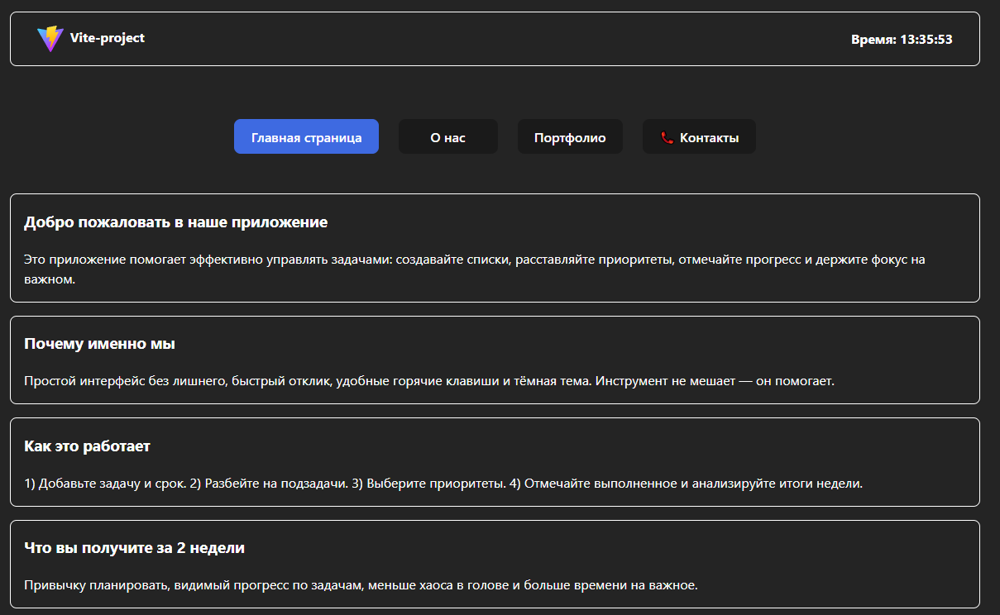

# Vite React App

## Стек
Vite, React, CSS Modules

## Запуск
- `npm i`
- `npm run dev`

## Скрипты
- `npm run build`
- `npm run lint`
- `npm run preview`

## Структура
src/
  assets/
  components/
    Button/
      Button.jsx
      style.module.css
    ContentCard/
      ContentCard.jsx
    Modal/
      Modal.jsx
      Modal.module.css
    Section/
      DifferenceSection.jsx
      FeedbackSection.jsx
      FunctionalBtnSection.jsx
      Header.jsx
      IntroductoryInfoSection.jsx
      PortfolioSection.jsx
      TabsSections.jsx
  styles/
    FeedbackSection.module.css
    PortfolioSection.module.css
  data.js
  App.jsx
  index.css
  main.jsx

.eslint.config.js
index.html
vite.config.js
package.json

## Скриншоты
